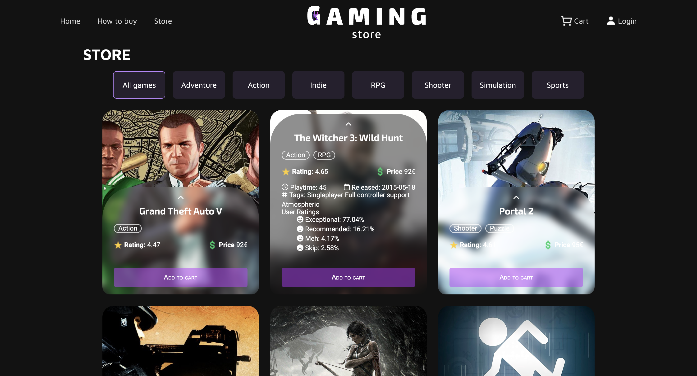
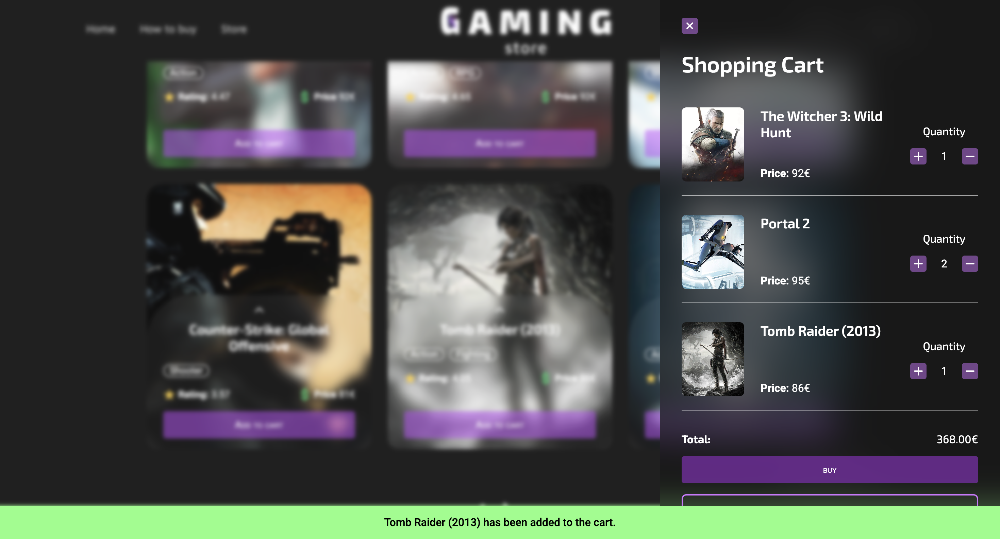

## GAMING STORE
- **Last update:** 30 de diciembre de 2022.
- **Link del proyecto:** [Gaming Store](https://gamingstore-bynatalia.vercel.app/)

### Descripcion
Proyecto de una tienda de videojuegos ficticia, con un diseño responsive y adaptado a dispositivos móviles.   

### Tecnologias
- HTML
- CSS
- JavaScript

### Instalacion
1. Clonar el repositorio
```bash
git clone
```
2. Ingresar a la carpeta del proyecto
```bash
cd gaming-store
```
3. Abrir el archivo index.html en el navegador

### Capturas






## Autor
- [Natalia Vega](https://www.linkedin.com/in/nataliacamilavega/)

